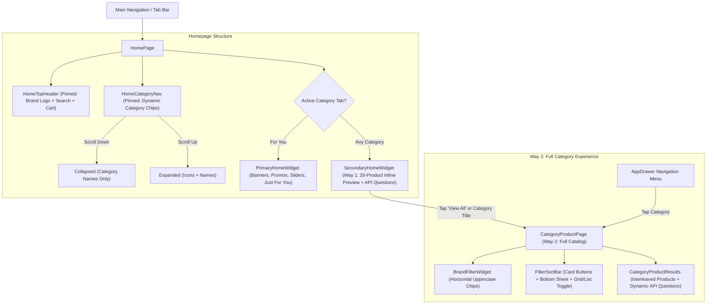

# 🚀 MissionNewUI: Pickaboo App Transformation Report

## 📌 Executive Summary
This documentation suite contains a comprehensive architectural and visual analysis of the **MissionNewUI** initiative. The core objective of this mission was to modernize **Pickaboo-App** by porting the modern, clean design system, UX patterns, and component behaviors from [`Pickaboo-App-UI`](file:///Users/pickaboomacmini/Projects/Pickaboo%20Flutter%20Applications/Pickaboo-App-UI) while **preserving 100% of live production functionality, API integrations, BLoC state management, and navigation routing**.

---

## 📑 Report Structure & Navigation

| Document | Topic | Description |
|---|---|---|
| [**01: Homepage Architecture**](file:///Users/pickaboomacmini/Projects/Pickaboo%20Flutter%20Applications/Pickaboo-App/MissionNewUI/01_HOMEPAGE_TRANSFORMATION.md) | Header & Dual Feeds | Consolidation into `PrimaryHomeWidget`, scroll-collapsible `HomeCategoryNav`, `HomeTopHeader`, and strict `AppSpacing`. |
| [**02: Category System & Routing**](file:///Users/pickaboomacmini/Projects/Pickaboo%20Flutter%20Applications/Pickaboo-App/MissionNewUI/02_CATEGORY_SYSTEM_AND_ROUTING.md) | Two-Way Category Architecture | Way 1 (`SecondaryHomeWidget` 20-product preview) vs Way 2 (`CategoryProductPage` full catalog), dynamic API filter questions, and unified Drawer/Home routing. |
| [**03: Product Card System**](file:///Users/pickaboomacmini/Projects/Pickaboo%20Flutter%20Applications/Pickaboo-App/MissionNewUI/03_PRODUCT_CARD_REDESIGN.md) | Modernized eCommerce Cards | 1:1 square aspect ratio, left-aligned brand/title/rating/price hierarchy, amber rating stars, inline discount pill badge, and carousel overflow fixes. |
| [**04: Dashboard & Design Tokens**](file:///Users/pickaboomacmini/Projects/Pickaboo%20Flutter%20Applications/Pickaboo-App/MissionNewUI/04_DASHBOARD_AND_DESIGN_SYSTEM.md) | Profile & Design Tokens | 12 overhauled dashboard pages, `NewAppColors`, `AppRadius`, `AppSpacing`, and new reusable core widgets. |
| [**05: Complete Change Catalog**](file:///Users/pickaboomacmini/Projects/Pickaboo%20Flutter%20Applications/Pickaboo-App/MissionNewUI/05_FULL_DIFF_AND_CHANGE_CATALOG.md) | Full File-by-File Catalog | Comprehensive table of all 60 modified and new files, rationale behind each edit, functionality preservation, and architectural remarks. |

---

## 🏛️ System Architecture Overview

---

## 🔑 Core Guarantees & Verification
1. **Zero Breaking Changes**: All API endpoints, BLoCs, pagination states, authentication tokens, repository interfaces, and deep links function exactly as in production.
2. **Dynamic Data Only**: No hardcoded dummy categories or fake questions; all filters are parsed in real-time from `FilterAttributeEntity` / `filterableAttributes`.
3. **Clean Build**: `flutter analyze` passes with **0 errors and 0 warnings**.
